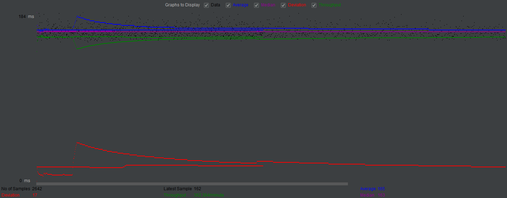
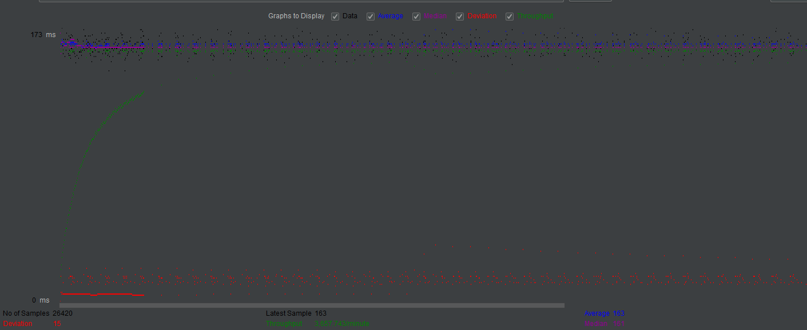
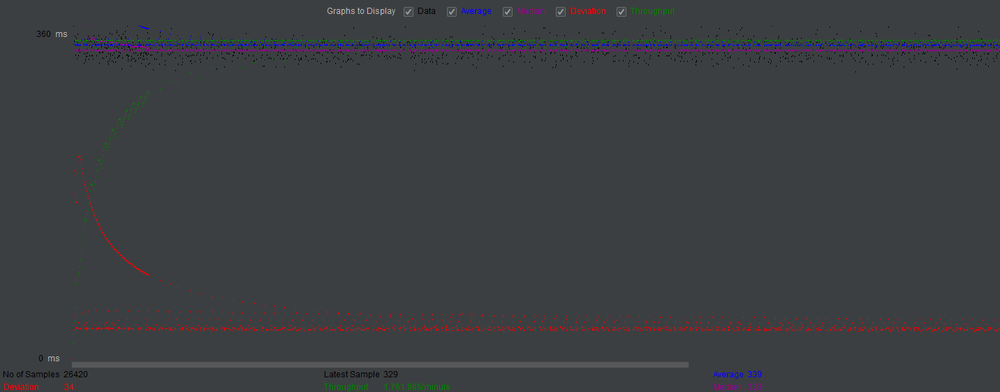
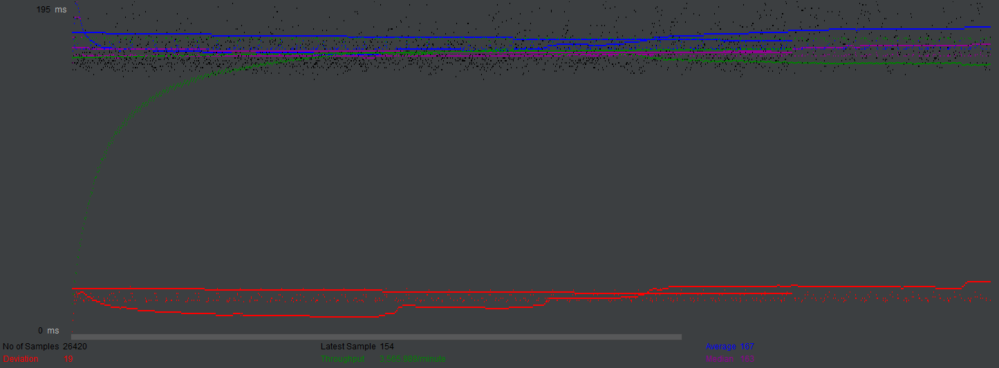
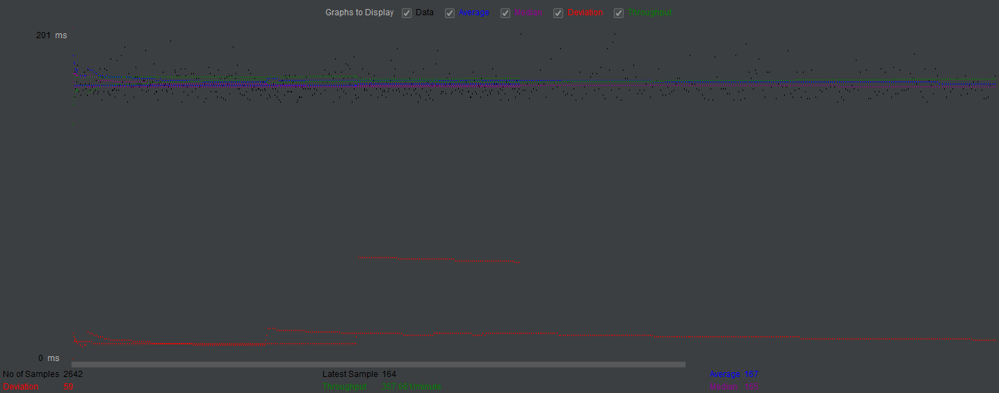
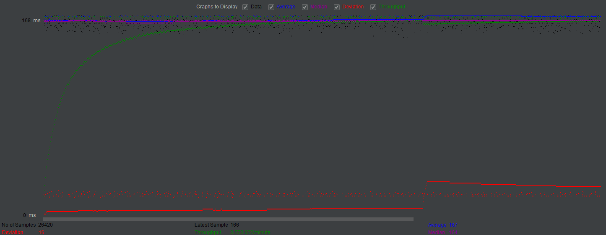
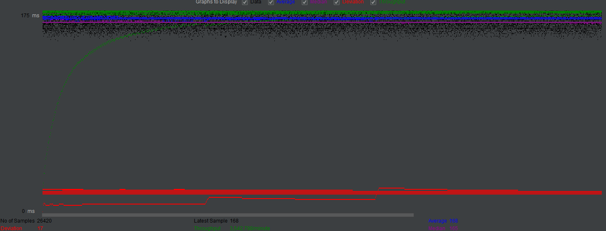

- # General
    - #### Team#: 165
    
    - #### Names: Yuxiang Qian (only 1 member); 
    
    - #### Project 5 Video Demo Link:

    - #### Instruction of deployment: 
        - create a test user and grant privileges:
            ```
            mysql> CREATE USER 'mytestuser'@'localhost' IDENTIFIED BY 'mypassword';
            mysql> GRANT ALL PRIVILEGES ON * . * TO 'mytestuser'@'localhost';
            mysql> quit;
            ```
        - create the database moviedb (you can create your own movie-data.sql):
            ```
            shell>mysql -u mytestuser-p < create_table.sql 
            shell>mysql -u mytestuser -p --database=moviedb < movie-data.sql 
            ```
        - On the development machine: Use maven to import the project, and make sure 
    you have complete IntelliJ IDEA Tomcat configuration. Then run the project.
        - On the AWS instance, in Webapp repo:
            ```
            shell>mvn package
            shell>cp ./target/*.war /home/ubuntu/tomcat/webapps
            Then refresh the tomcat manager page and click on project_2
            Then you should successfully see the website.
            ```

    - #### Collaborations and Work Distribution: I do not have a teammate, there is only one member in this team. I contribute to everything in the project.
    - Note: 
        - Webapp_single folder contains the single version of the Fabflix web application
        - Webapp folder contains the scaled version of Fabflix web application
        - MobileApp folder contains the Android version of fabflix
        - Parser folder contains code for XML parsing


- # Connection Pooling
    - #### Include the filename/path of all code/configuration files in GitHub of using JDBC Connection Pooling.
        - Configuration: [(Scaled)context.xml](Webapp/WebContent/META-INF/context.xml)<br />
        [(Single)context.xml](Webapp_single/WebContent/META-INF/context.xml)<br />
        - Code: [AddMovieServlet.java](Webapp/src/AddMovieServlet.java)<br />
        [AddStarServlet.java](Webapp/src/AddStarServlet.java)<br />
        [AutoCompleteServlet.java](Webapp/src/AutoCompleteServlet.java)<br />
        [CartServlet.java](Webapp/src/CartServlet.java)<br />
        [GenreServlet.java](Webapp/src/GenreServlet.java)<br />
        [LoginServlet.java](Webapp/src/LoginServlet.java)<br />
        [MetadataServlet.java](Webapp/src/MetadataServlet.java)<br />
        [MovieListServlet.java](Webapp/src/MovieListServlet.java)<br />
        [PayServlet.java](Webapp/src/PayServlet.java)<br />
        [SingleMovieServlet.java](Webapp/src/SingleMovieServlet.java)<br />
        [SingleStarServlet.java](Webapp/src/SingleStarServlet.java)
    - #### Explain how Connection Pooling is utilized in the Fabflix code.
        - To utilize connection pooling, we add these configurations to the source we need to use in context.xml:
            ```
            maxTotal="100" maxIdle="30" maxWaitMillis="10000"
            ```
          and we add 
            ```
            "autoReconnect=true&amp;useSSL=false&amp;cachePrepStmts=true"
            ```
          to the url. Then in every servlet that need connections to the database, we first
          look up the data source we want and then set up the connection.
         
    - #### Explain how Connection Pooling works with two backend SQL.
        - I define two different resources in context.xml. The first resource (named "jdbc/masterdb") 
         point to the backend SQL of the master, and the second resource (named "jdbc/slavedb") points 
         to the backend SQL of the slave. Both of them enable connection 
         pooling by setting maxTotal="100" maxIdle="30" maxWaitMillis="10000".
        

- # Master/Slave
    - #### Include the filename/path of all code/configuration files in GitHub of routing queries to Master/Slave SQL.
        - Configuration: [(Scaled)context.xml](Webapp/WebContent/META-INF/context.xml)<br />
        - Code:
            - to Master SQL: <br />
            [AddMovieServlet.java](Webapp/src/AddMovieServlet.java)<br />
            [AddStarServlet.java](Webapp/src/AddStarServlet.java)<br />
            [PayServlet.java](Webapp/src/PayServlet.java)<br />
            - to Slave SQL:<br />
            [AutoCompleteServlet.java](Webapp/src/AutoCompleteServlet.java)<br />
            [CartServlet.java](Webapp/src/CartServlet.java)<br />
            [GenreServlet.java](Webapp/src/GenreServlet.java)<br />
            [LoginServlet.java](Webapp/src/LoginServlet.java)<br />
            [MetadataServlet.java](Webapp/src/MetadataServlet.java)<br />
            [MovieListServlet.java](Webapp/src/MovieListServlet.java)<br />
            [SingleMovieServlet.java](Webapp/src/SingleMovieServlet.java)<br />
            [SingleStarServlet.java](Webapp/src/SingleStarServlet.java)
    - #### How read/write requests were routed to Master/Slave SQL?
        - First I define the two differen resources in context.xml with one (named "jdbc/masterdb") points to master SQL
        and the other (named "jdbc/slavedb")  points to slave SQL . Then for servlets that need to write to SQL,
        it will look up the master's datasource by:
        ```
        DataSource ds = (DataSource) envContext.lookup("jdbc/masterdb");
        ```
        For the servlets that only need to read from the SQL, it will look up the slave's 
        data source by:
        ```
        DataSource ds = (DataSource) envContext.lookup("jdbc/slavedb");
        ```

- # JMeter TS/TJ Time Logs
    - #### Instructions of how to use the `log_processing.*` script to process the JMeter logs.
        - put it in the same directory as a 'log.txt' file, and directly run it.

- # JMeter TS/TJ Time Measurement Report

| **Single-instance Version Test Plan**          | **Graph Results Screenshot** | **Average Query Time(ms)** | **Average Search Servlet Time(ms)** | **Average JDBC Time(ms)** | **Analysis** |
|------------------------------------------------|------------------------------|----------------------------|-------------------------------------|---------------------------|--------------|
| Case 1: HTTP/1 thread                          |     | 165                         | 2.602574                                   | 2.325132                        | Compared to https, it has less average query time         |
| Case 2: HTTP/10 threads                        |    | 163                       |  2.723089                                |  2.325132                      | It has similar time as case 1, but compared to https, it still has less average query time          |
| Case 3: HTTPS/10 threads                       |    | 339                         | 2.890121                                  | 2.774565                        | Compared to case1 and 2, it has much more average query time          |
| Case 4: HTTP/10 threads/No connection pooling  |     | 167                        | 3.326079                                  | 3.231605                        | Compared to all case 1,2,3, it has more TS and TJ time           |

| **Scaled Version Test Plan**                   | **Graph Results Screenshot** | **Average Query Time(ms)** | **Average Search Servlet Time(ms)** | **Average JDBC Time(ms)** | **Analysis** |
|------------------------------------------------|------------------------------|----------------------------|-------------------------------------|---------------------------|--------------|
| Case 1: HTTP/1 thread                          |     | 167                         | 3.280469                                  | 2.976533                        | It performs better than case4, but are similar to case1 and 2           |
| Case 2: HTTP/10 threads                        |    | 167                         | 3.223354                               | 3.112226                       | It also performs better than case4, but are similar to case1 and 2            |
| Case 3: HTTP/10 threads/No connection pooling  |     | 168                         | 4.939213                                 | 3.925662                        | It has apparently more TS and TJ time than case5 and 6 and more average query time           |
